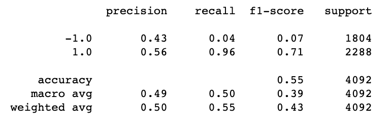
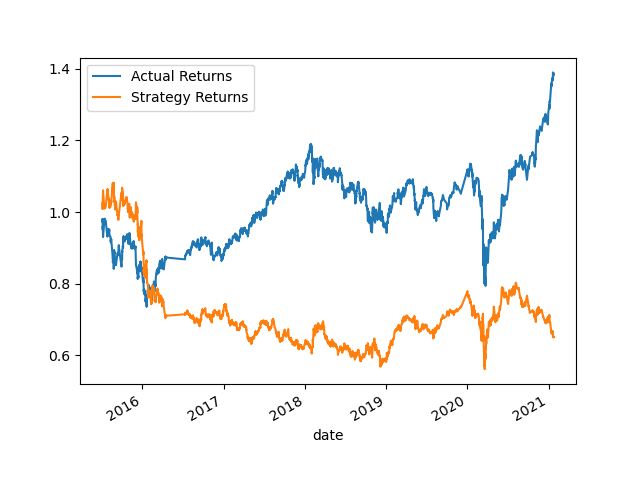
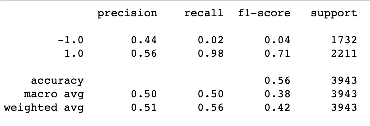
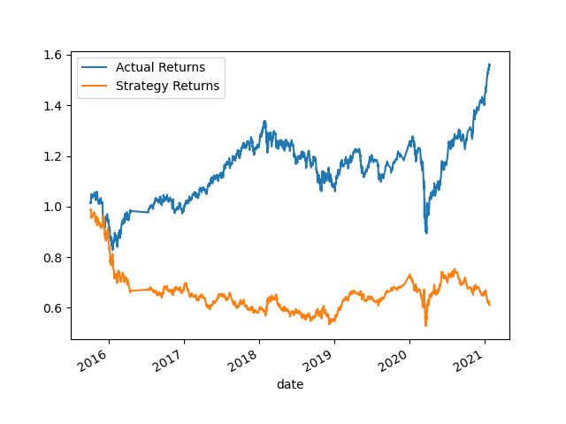
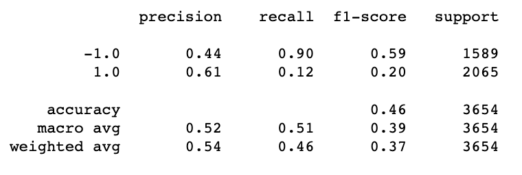
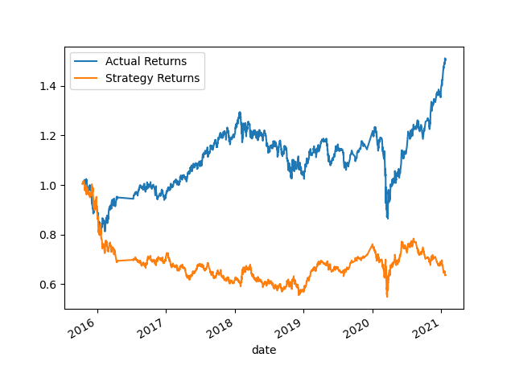
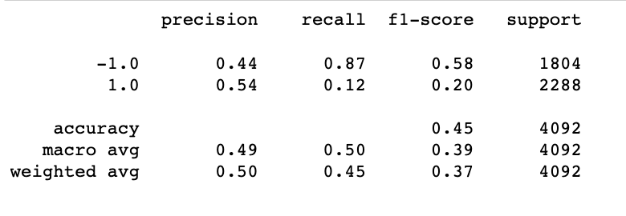

# Machine Learning Trading Bot

## Overview 
The goal of this project is to create algorithmic trading strategy that uses machine learning in order to automate the trade decisions, adjust the input data to improve upon the trading algorithm, trained a new machine learning model and compare its performance to that of a baseline model and finally evulate the preformance of the different models.

Here are a summary of the steps 
- Establish Baseline Performance
- Tune the Baseline Trading Algorithm
- Evaluate a New Machine Learning Classifier

___________________________________________________________
## Establish a Baseline Performance

### Inputs: 
- Ending period for the training data: 3 months
- Short-window for SMA: 4
- Long-window for SMA: 100

## Tune the Baseline Trading Algorithm

### 6 Months Window
- Ending period for the training data: 6 months
- Short-window for SMA: 4
- Long-window for SMA: 100

- Increasing the window from 3 months baseline to 6 months resulted in a greater divide of Acutal returns vs Strategy returns

### Window 25 to 250
- Ending period for the training data: 3 months
- Short-window for SMA: 25
- Long-window for SMA: 250

- Changing the short and long window results compared to the baseline is relatively the same but in the beginning the model for Actual and Strategy returns was closer aligned 

## Evaluate a New Machine Learning Classifier
- Ending period for the training data: 3 months
- Short-window for SMA: 4
- Long-window for SMA: 100

- It appears that the precision for the Decision Tree Classification for precision vs the basline SMV models is relatively the same. However, it appears the SVM does better when it comes to recall. 
